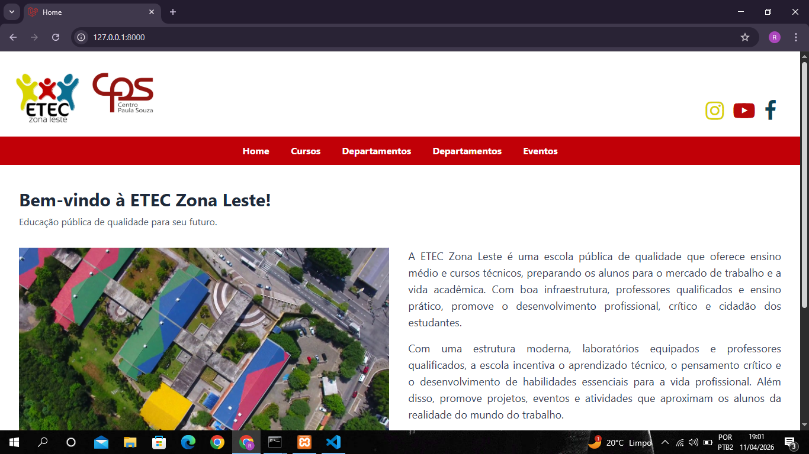
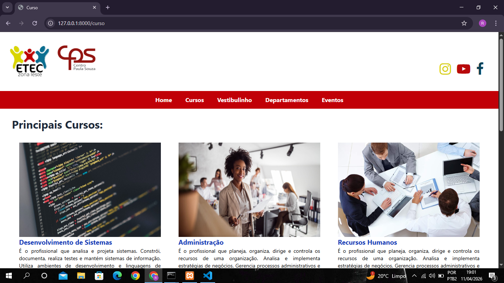
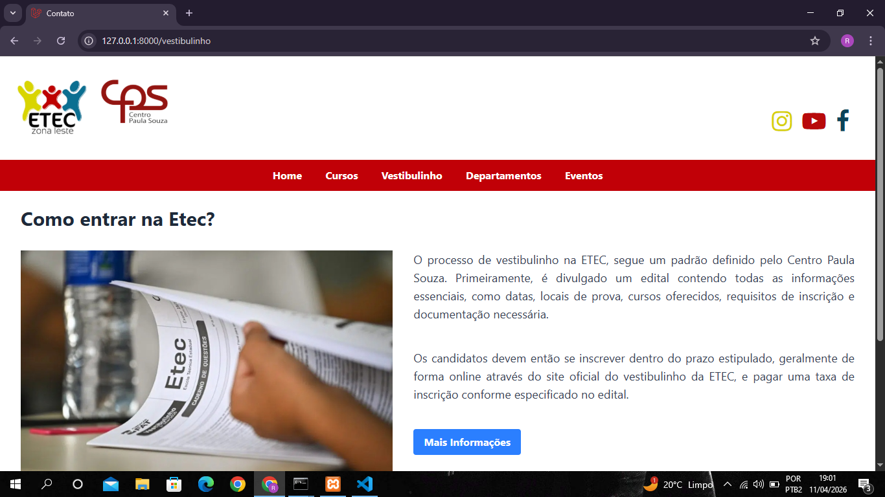
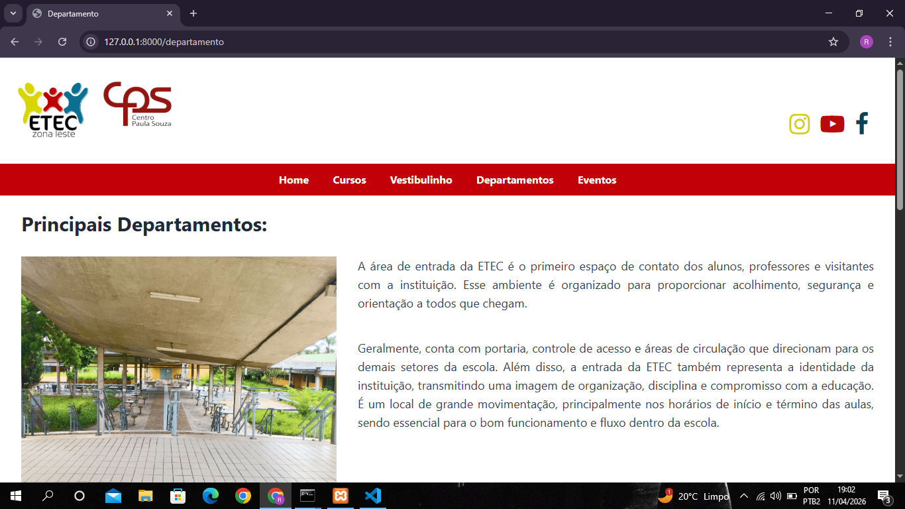
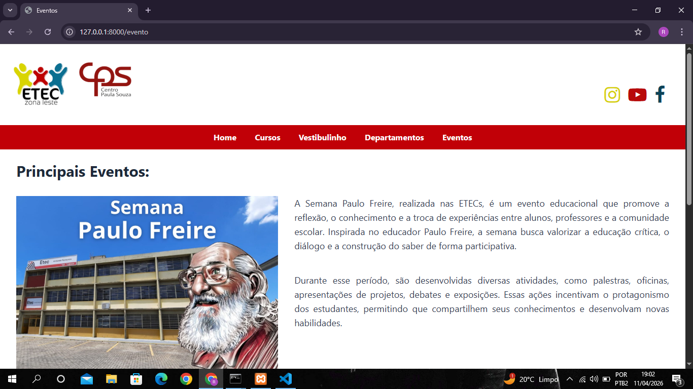

<h1>Protótipo Site Etec da Zona Leste</h1>

<h2>Motivo:</h2>

Compreender as principais funcionalidades do framework Laravel, ministrada na matéria de PWIII.

<h2>Tecnologias Utilizadas:</h2>
<ul>
    <li>Laravel</li>
    <li>tailwind</li>  
    <li>HTML5</li> 
</ul>

<h2>Funcionalidades:</h2>

Ao acessar o site em Home, nos deparamos com elementos que exibem a instituição de ensino, bem outras funcionalidades pertinentes ao cenário da Etec Zona Leste:

 

 

O site também conta com uma janela que apresenta os principais cursos oferecidos:

 

Contém uma página explicativa sobre o vestibulinho e que direciona para o site oficial do Vestibulinho Etec:

 

Apresenta os principais departamentos da Etec:

 

Deixa o usuário informado sobre os principais eventos:

 
<h2>Demonstração:</h2>

 
<h2>Instalação:</h2>
<ul>
  <li>Instalar o Laravel (consultar documentação), preferencialmente a versão 13 (mais recente) usada neste projeto.</li>

  <li>Instalar o Node.js (NPM já vem junto com o Node.js).</li>

  <li>Com o Laravel instalado, executar o comando:
     
    <code>php artisan serve</code>
  </li>

  <li>Com o NPM instalado, executar o comando:
     
    <code>npm run dev</code>
     
    (necessário para o Tailwind CSS funcionar)
  </li>
  <li>Baixar e inicializar o Xampp</li>

  <li>Acessar o link gerado pelo comando <code>php artisan serve</code> no navegador para usar o site.</li>
</ul>

